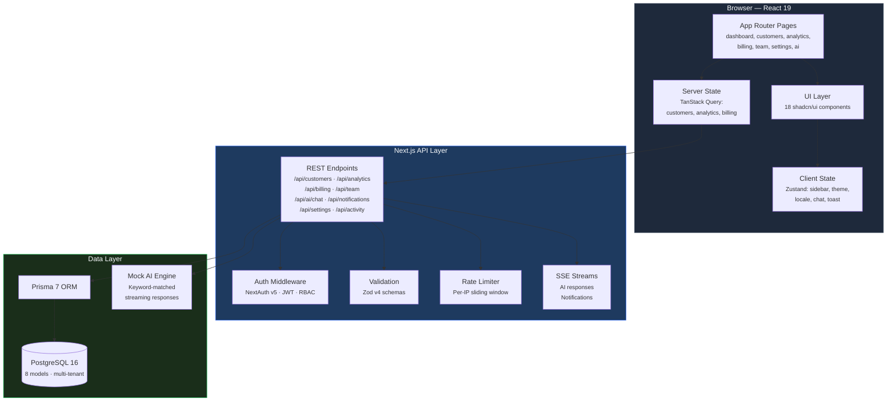
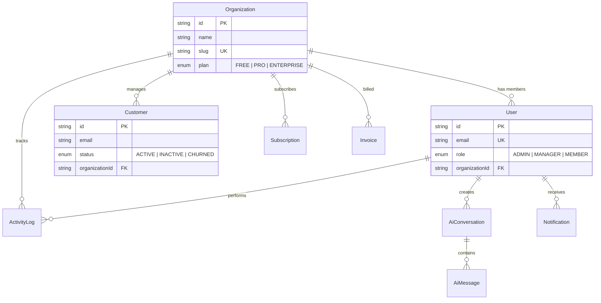

<h1 align="center">Nexus AI</h1>

<p align="center">
  <strong>Production-grade AI-integrated SaaS dashboard — zero operational cost</strong>
</p>

<p align="center">
  <a href="https://github.com/mer-prog/nexus-ai/actions/workflows/ci.yml"></a>
  
  
  
  
  
  
</p>

<p align="center">
  A multi-tenant SaaS management dashboard with AI-powered analytics, real-time streaming,<br>
  role-based access control, and full i18n — built to production standards with every external service mocked.
</p>

---

## Why This Project

Most portfolio projects are CRUD apps with a login page. This one isn't.

**Nexus AI** demonstrates the architecture, engineering patterns, and attention to detail required of a production SaaS platform — multi-tenant isolation, streaming AI responses, granular RBAC, real-time notifications, billing workflows — while running at **zero operational cost** through a carefully designed mock layer.

Every line of code is written as if it were shipping to paying customers.

---

## Tech Stack

| Layer | Technology | Why |
|-------|-----------|-----|
| **Framework** | Next.js 16 (App Router) | Server Components, streaming, file-based routing |
| **Runtime** | React 19 | Concurrent features, `use()` hook, Server Actions |
| **Language** | TypeScript 5 (strict) | Zero `any` — full type safety across the stack |
| **Styling** | Tailwind CSS 4 + shadcn/ui | Utility-first with accessible, composable components |
| **Database** | Prisma 7 + PostgreSQL 16 | Type-safe ORM with migrations and seeding |
| **Auth** | NextAuth v5 (Auth.js) | JWT sessions, Credentials + Google OAuth providers |
| **Validation** | Zod v4 | Runtime schema validation for all API boundaries |
| **State** | Zustand + TanStack Query | Client state + server state, cleanly separated |
| **Charts** | Recharts 3 | Composable, responsive data visualization |
| **i18n** | Custom hook-based (EN/JA) | Lightweight, no heavy framework dependency |
| **Testing** | Vitest + RTL + Playwright | Unit, integration, and E2E coverage |
| **CI/CD** | GitHub Actions | Lint → Typecheck → Test (with coverage) → Build |
| **Deploy** | Vercel (hnd1) | Edge-optimized, zero-config deployment |

---

## Architecture



### Data Model



---

## Getting Started

### Prerequisites

- **Node.js** 20+
- **Docker** (for PostgreSQL) or a remote PostgreSQL instance

### Quick Start

```bash
# Clone
git clone https://github.com/mer-prog/nexus-ai.git
cd nexus-ai

# Start PostgreSQL
docker compose up -d

# Install & set up
npm install
npx prisma migrate deploy
npm run db:seed

# Launch
npm run dev
```

Open **http://localhost:3000** — you're in.

### Demo Accounts

| Role | Email | Password | Access Level |
|------|-------|----------|-------------|
| **Admin** | `admin@acme.com` | `password123` | Full access — team management, org settings, danger zone |
| **Manager** | `manager@acme.com` | `password123` | Customers, analytics, billing — no team/org admin |
| **Member** | `member@acme.com` | `password123` | Read-only dashboard, AI chat, own profile |

---

## Project Structure

```
nexus-ai/
├── src/
│   ├── app/                          # Next.js App Router
│   │   ├── api/                      # API routes (9 resource groups)
│   │   │   ├── activity/             #   Activity log endpoints
│   │   │   ├── ai/                   #   AI chat with SSE streaming
│   │   │   ├── analytics/            #   Analytics data & AI analysis
│   │   │   ├── auth/                 #   NextAuth route handler
│   │   │   ├── billing/              #   Subscriptions & invoices
│   │   │   ├── customers/            #   CRUD with pagination
│   │   │   ├── notifications/        #   Real-time SSE notifications
│   │   │   ├── settings/             #   Org & profile management
│   │   │   └── team/                 #   Team & role management
│   │   ├── dashboard/                # Protected dashboard pages
│   │   │   ├── ai/                   #   Full-page AI assistant
│   │   │   ├── analytics/            #   Charts & data export
│   │   │   ├── billing/              #   Plans & invoices
│   │   │   ├── customers/            #   Customer list & detail ([id])
│   │   │   ├── settings/             #   Preferences & danger zone
│   │   │   └── team/                 #   Member management
│   │   └── login/                    # Auth pages
│   ├── components/
│   │   ├── ui/                       # 18 shadcn/ui primitives
│   │   ├── layout/                   # Shell, header, sidebar, notifications
│   │   ├── dashboard/                # KPI cards, revenue chart, activity feed
│   │   ├── customers/                # Table, form dialog, pagination
│   │   ├── ai/                       # Chat widget (floating)
│   │   └── team/                     # Team table, invite dialog
│   ├── hooks/                        # 5 custom hooks
│   │   ├── use-translations.ts       #   i18n hook (EN/JA)
│   │   ├── use-customers.ts          #   Customer data + mutations
│   │   ├── use-analytics.ts          #   Analytics data fetching
│   │   ├── use-notifications.ts      #   Real-time notification stream
│   │   └── use-user-role.ts          #   RBAC hook
│   ├── stores/                       # 5 Zustand stores
│   │   ├── sidebar-store.ts          #   Sidebar open/close state
│   │   ├── theme-store.ts            #   Light / dark / system
│   │   ├── locale-store.ts           #   EN / JA persistence
│   │   ├── chat-store.ts             #   AI conversation state
│   │   └── toast-store.ts            #   Toast notification queue
│   ├── lib/                          # Shared utilities
│   │   ├── auth.ts                   #   NextAuth configuration
│   │   ├── db.ts                     #   Prisma client singleton
│   │   ├── ai-mock.ts               #   Mock AI response engine
│   │   ├── rate-limit.ts            #   Per-IP rate limiter
│   │   ├── api-helpers.ts           #   Unified API response helpers
│   │   ├── validations/             #   Zod schemas (customer, team)
│   │   └── markdown.ts              #   Markdown → HTML renderer
│   └── generated/prisma/            # Prisma generated client
├── prisma/
│   ├── schema.prisma                 # 8 models, multi-tenant schema
│   └── seed.ts                       # Realistic demo data seeder
├── tests/
│   ├── unit/                         # 14 test files
│   │   ├── api/                      #   API route tests
│   │   ├── components/               #   Component tests (RTL)
│   │   ├── lib/                      #   Utility tests
│   │   ├── stores/                   #   Store tests
│   │   └── validations/              #   Schema tests
│   └── e2e/                          # 4 Playwright specs
│       ├── auth.spec.ts              #   Login/logout flows
│       ├── dashboard.spec.ts         #   Dashboard interactions
│       ├── customers.spec.ts         #   Customer CRUD flows
│       └── ai-chat.spec.ts           #   AI chat interactions
├── .github/workflows/ci.yml         # CI: lint → typecheck → test → build
├── docker-compose.yml                # PostgreSQL 16 (Alpine)
├── vercel.json                       # Deploy config + security headers
└── package.json
```

---

## Features

### Multi-Tenant Dashboard
- KPI cards: MRR, active users, churn rate, growth rate
- Revenue trend chart with interactive tooltips (Recharts)
- Recent activity feed with real-time updates

### Customer Management
- Full CRUD with optimistic UI updates
- Server-side search, status filtering, column sorting
- Paginated table with configurable page size
- Customer detail pages with activity history

### AI Integration
- **Floating chat widget** — accessible from any page
- **Full-page AI assistant** — conversation sidebar with history
- **SSE streaming** — responses appear token-by-token
- **Markdown rendering** — headers, tables, code blocks with syntax highlighting
- **AI-powered analytics** — one-click data analysis reports

### Analytics & Reporting
- Interactive line, pie, and bar charts
- Period filtering: 7 days / 30 days / 90 days
- One-click CSV data export
- AI-generated analysis summaries

### Billing & Subscriptions
- Plan comparison: Free / Pro / Enterprise
- Subscription lifecycle management (upgrade, downgrade, cancel)
- Invoice history with detail modals
- Invoice CSV export

### Team & Access Control
- Three-tier RBAC: Admin → Manager → Member
- Admin-only team management and role assignment
- Member invitation flow
- UI elements conditionally rendered by role

### Settings & Personalization
- Organization settings (name, slug)
- Profile management (name, email, password)
- Notification preferences (email & push toggles)
- Theme: light / dark / system-auto
- Language: English / Japanese

### Real-Time Notifications
- Server-Sent Events for push notifications
- Unread count badge in header
- Mark as read (individual and bulk)
- Auto-dismiss on outside click

---

## Engineering Highlights

This section outlines the architectural decisions that distinguish this project from typical portfolio work.

### Multi-Tenant Isolation

Every data query is scoped to `organizationId`. There is no path where one tenant can access another tenant's data — enforced at the ORM layer, not just the API layer.

### Streaming AI with SSE

The AI chat uses Server-Sent Events to stream mock responses token-by-token, simulating real LLM behavior. The client renders Markdown incrementally as tokens arrive — no full-page re-renders, no polling.

### Layered API Security

```
Request → Rate Limiter (per-IP sliding window)
        → Auth (JWT verification)
        → RBAC (role-based route guard)
        → Zod (input validation)
        → Handler (business logic)
        → Prisma (tenant-scoped query)
```

### Security Headers (Production-Ready)

Configured in `vercel.json` and applied to every response:

| Header | Value | Purpose |
|--------|-------|---------|
| `X-Content-Type-Options` | `nosniff` | Prevent MIME-type sniffing |
| `X-Frame-Options` | `DENY` | Block clickjacking |
| `X-XSS-Protection` | `1; mode=block` | Legacy XSS filter |
| `Referrer-Policy` | `strict-origin-when-cross-origin` | Control referrer leakage |

### State Architecture

Client and server state are intentionally separated:

- **Zustand** — UI-only state (sidebar, theme, locale, toast, chat). Synchronous, no network.
- **TanStack Query** — server state (customers, analytics, billing). Handles caching, revalidation, and optimistic updates.

This avoids the common anti-pattern of stuffing server data into a global store.

### Zero-Cost Mock Layer

| Real Service | Mock Implementation | Fidelity |
|-------------|-------------------|----------|
| OpenAI / Anthropic | Keyword-matched SSE streaming | Token-by-token, Markdown formatting |
| Stripe | Local subscription engine | Full plan lifecycle, invoices |
| Google OAuth | NextAuth Credentials provider | Same auth flow, swappable |
| SendGrid / SES | Console log + UI toast | Trigger and display preserved |
| AWS S3 | Local `public/uploads` | Same upload API surface |

The mock layer is designed so that replacing any mock with a real service requires changing **one file** — no cascading refactors.

---

## Testing

```bash
npm test                 # Run all unit tests
npm run test:coverage    # Unit tests with coverage report
npm run test:e2e         # Playwright E2E suite (requires dev server)
npm run typecheck        # TypeScript strict mode check
npm run lint             # ESLint
```

### Test Distribution

| Category | Files | Scope |
|----------|-------|-------|
| **API routes** | 4 | Request/response, auth guards, validation |
| **Components** | 4 | Rendering, interactions, accessibility |
| **Utilities** | 3 | AI mock engine, API helpers, Markdown parser |
| **Stores** | 1 | Zustand state transitions |
| **Validations** | 2 | Zod schema edge cases |
| **E2E** | 4 | Auth, dashboard, customers, AI chat |

### CI Pipeline

```
┌───────────┐
│   Lint    │─────┐
└───────────┘     │
┌───────────┐     │    ┌───────┐
│ TypeCheck │─────┼───▶│ Build │
└───────────┘     │    └───────┘
┌───────────┐     │
│   Tests   │─────┘
│ +Coverage │
└───────────┘
```

Lint, TypeCheck, and Tests run **in parallel**. Build only triggers after all three pass. The test job spins up a PostgreSQL 16 service container, runs migrations, seeds data, and uploads a coverage report artifact.

---

## Environment Variables

Copy `.env.example` to `.env` and fill in values:

```bash
cp .env.example .env
```

| Variable | Required | Description |
|----------|----------|-------------|
| `DATABASE_URL` | Yes | PostgreSQL connection string |
| `NEXTAUTH_SECRET` | Yes | JWT signing secret (`openssl rand -base64 32`) |
| `NEXTAUTH_URL` | Yes | Application URL (`http://localhost:3000`) |
| `DIRECT_URL` | For Neon | Direct connection for migrations |
| `GOOGLE_CLIENT_ID` | No | Google OAuth (falls back to Credentials) |
| `AI_API_KEY` | No | AI service key (mocked in demo) |
| `STRIPE_SECRET_KEY` | No | Stripe key (mocked in demo) |

---

## License

[MIT](LICENSE) — Built by [mer-prog](https://github.com/mer-prog)
