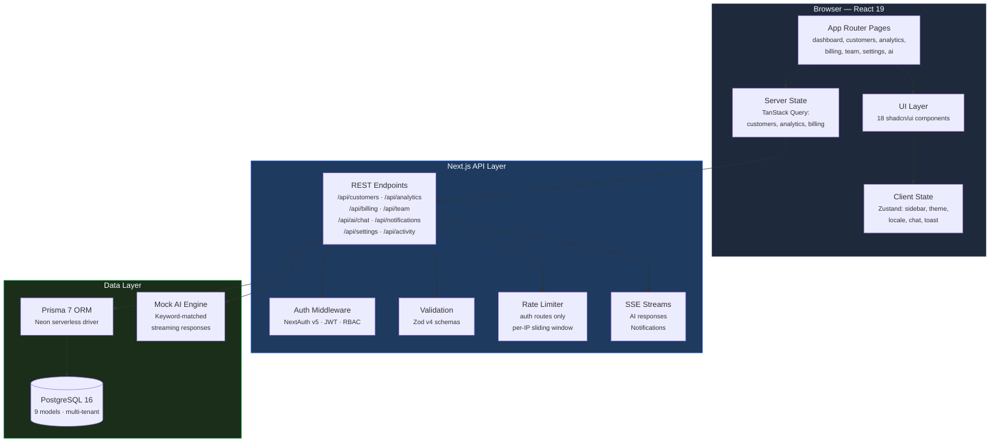
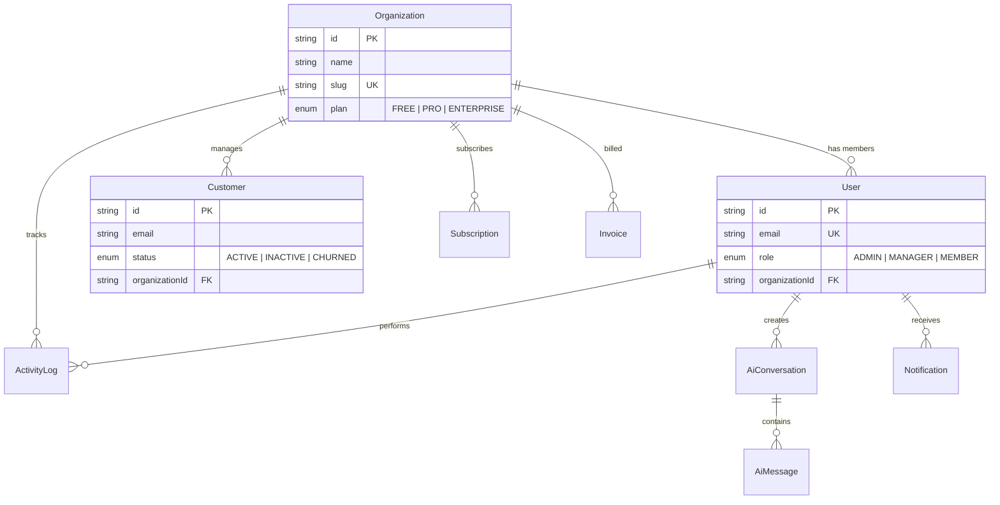

<h1 align="center">Nexus AI</h1>

<p align="center">
  <strong>マルチテナント SaaS 管理ダッシュボード — 外部サービスをすべてモック化し、運用コスト $0 で本番水準の設計を実証</strong><br>
  <em>A multi-tenant SaaS management dashboard — every external service mocked, production-standard engineering at zero operational cost</em>
</p>

<p align="center">
  <a href="https://github.com/mer-prog/nexus-ai/actions/workflows/ci.yml"></a>
  
  
  
  
  
  
</p>

<p align="center">
  AI チャット（SSE ストリーミング）・RBAC・課金ワークフロー・リアルタイム通知・日英 i18n を備えた SaaS 管理画面。<br>
  <strong>AI を含む外部サービスはすべてモック</strong>であることを最初に明示します — このリポジトリが示すのは LLM 連携ではなく、その周辺を支える設計と実装規律です。<br>
  <em>Streaming AI chat, RBAC, billing workflows, real-time notifications, and JA/EN i18n. <strong>Every external service — including the AI — is mocked</strong>, stated up front: what this repo demonstrates is the engineering discipline around them, not an LLM integration.</em>
</p>

---

## ハイライト / Highlights

- **127 テスト** — ユニット 110（Vitest・14 ファイル）+ E2E 17（Playwright・4 スペック）。API ルートの認可ガード・Zod 検証・ページネーションから UI 操作まで検証 / **127 tests** — 110 unit (Vitest) + 17 E2E (Playwright), covering auth guards, validation, pagination, and real UI flows
- **TypeScript strict・`any` ゼロ** — 全 API 境界を Zod v4 で実行時検証 / **TypeScript strict, zero `any`** — Zod v4 runtime validation at every API boundary
- **GitHub Actions CI（4 ジョブ）** — Lint / TypeCheck / Test（PostgreSQL 16 コンテナへのマイグレーション適用検証 + カバレッジ）/ Build / **4-job CI** — lint, typecheck, test (migration check against PostgreSQL 16 + coverage), build
- **マルチテナント分離** — 全クエリをハンドラ内で `organizationId` にスコープし、テストで担保 / **Multi-tenant isolation** — every query scoped by `organizationId` in the handler, backed by tests
- **ゼロコスト・モック層** — AI（SSE 擬似ストリーミング）・Stripe 相当の課金・OAuth を差し替え可能なモックで実装 / **Zero-cost mock layer** — AI (simulated SSE streaming), Stripe-like billing, and OAuth as swappable mocks

## なぜこのプロジェクトか / Why This Project

ポートフォリオの多くは「ログインページ付き CRUD」で終わります。Nexus AI は、本番 SaaS に求められる要素 — マルチテナント分離・ストリーミング応答・段階的 RBAC・リアルタイム通知・課金ワークフロー — を、慎重に設計したモック層の上で**運用コスト $0** のまま実装したものです。

*Most portfolio projects are CRUD apps with a login page. Nexus AI implements what a production SaaS actually requires — tenant isolation, streaming responses, granular RBAC, real-time notifications, billing workflows — on a carefully designed mock layer, at zero operational cost.*

## 技術スタック / Tech Stack

| レイヤ / Layer | 技術 / Technology | 選定理由 / Why |
|-------|-----------|-----|
| **Framework** | Next.js 16 (App Router) | Server Components・ストリーミング・ファイルベースルーティング |
| **Runtime** | React 19 | Concurrent features, `use()` hook |
| **Language** | TypeScript 5 (strict) | `any` ゼロ — スタック全体の型安全 |
| **Styling** | Tailwind CSS 4 + shadcn/ui (18 components) | ユーティリティファースト + アクセシブルな合成可能コンポーネント |
| **Database** | Prisma 7 + PostgreSQL 16 | 型安全 ORM。マイグレーション（`prisma/migrations/`）・シーディング同梱 |
| **Auth** | NextAuth v5 (Auth.js) | JWT セッション、Credentials + Google OAuth プロバイダ |
| **Validation** | Zod v4 | 全 API 境界の実行時スキーマ検証 |
| **State** | Zustand (5 stores) + TanStack Query | クライアント状態とサーバー状態の分離 |
| **Charts** | Recharts 3 | 合成可能・レスポンシブなデータ可視化 |
| **i18n** | 独自フックベース (JA/EN) | Zustand + Cookie 永続化、ロケール対応フォーマット |
| **Testing** | Vitest + RTL + Playwright | ユニット・コンポーネント・E2E |
| **CI/CD** | GitHub Actions | Lint → TypeCheck → Test (+coverage) → Build |
| **Deploy** | Vercel (hnd1) + Neon | サーバーレス PostgreSQL で $0 運用 |

## アーキテクチャ / Architecture


```mermaid
graph TB
    subgraph Client["Browser — React 19"]
        Pages["App Router Pages<br/><small>dashboard, customers, analytics,<br/>billing, team, settings, ai</small>"]
        UI["UI Layer<br/><small>18 shadcn/ui components</small>"]
        State["Client State<br/><small>Zustand: sidebar, theme,<br/>locale, chat, toast</small>"]
        ServerState["Server State<br/><small>TanStack Query:<br/>customers, analytics, billing</small>"]
    end

    subgraph API["Next.js API Layer"]
        Routes["REST Endpoints<br/><small>/api/customers · /api/analytics<br/>/api/billing · /api/team<br/>/api/ai/chat · /api/notifications<br/>/api/settings · /api/activity</small>"]
        Auth["Auth Middleware<br/><small>NextAuth v5 · JWT · RBAC</small>"]
        Validate["Validation<br/><small>Zod v4 schemas</small>"]
        RateLimit["Rate Limiter<br/><small>auth routes only<br/>per-IP sliding window</small>"]
        SSE["SSE Streams<br/><small>AI responses<br/>Notifications</small>"]
    end

    subgraph Data["Data Layer"]
        ORM["Prisma 7 ORM<br/><small>Neon serverless driver</small>"]
        DB[("PostgreSQL 16<br/><small>9 models · multi-tenant</small>")]
        MockAI["Mock AI Engine<br/><small>Keyword-matched<br/>streaming responses</small>"]
    end

    Pages --> UI
    Pages --> ServerState
    UI --> State
    ServerState --> Routes
    Routes --> Auth
    Routes --> Validate
    Routes --> RateLimit
    Routes --> ORM
    Routes --> MockAI
    Routes --> SSE
    ORM --> DB

    style Client fill:#1e293b,stroke:#334155,color:#f8fafc
    style API fill:#1e3a5f,stroke:#2563eb,color:#f8fafc
    style Data fill:#1a2e1a,stroke:#22c55e,color:#f8fafc
```

### データモデル / Data Model

9 モデル・マルチテナント構成（`prisma/schema.prisma`）。 *9 models, multi-tenant (`prisma/schema.prisma`).*


```mermaid
erDiagram
    Organization ||--o{ User : "has members"
    Organization ||--o{ Customer : "manages"
    Organization ||--o{ Subscription : "subscribes"
    Organization ||--o{ Invoice : "billed"
    Organization ||--o{ ActivityLog : "tracks"
    User ||--o{ AiConversation : "creates"
    User ||--o{ Notification : "receives"
    User ||--o{ ActivityLog : "performs"
    AiConversation ||--o{ AiMessage : "contains"

    Organization {
        string id PK
        string name
        string slug UK
        enum plan "FREE | PRO | ENTERPRISE"
    }
    User {
        string id PK
        string email UK
        enum role "ADMIN | MANAGER | MEMBER"
        string organizationId FK
    }
    Customer {
        string id PK
        string email
        enum status "ACTIVE | INACTIVE | CHURNED"
        string organizationId FK
    }
```

## セットアップ / Getting Started

### 前提 / Prerequisites

- **Node.js** 20+
- **PostgreSQL** — [Neon](https://neon.tech)（無料枠あり）を推奨 / Neon (free tier) recommended

> **接続方式に関する注記 / Note on connectivity**
> アプリ本体とシードスクリプトは **Neon serverless driver（WebSocket 接続）** で DB に接続します。素の TCP PostgreSQL（同梱の `docker-compose.yml` を含む）には、Prisma CLI によるマイグレーション適用は可能ですが、アプリの実行とシードはできません。`docker-compose.yml` と CI の Postgres はマイグレーション検証用です。
> *The app runtime and the seed script connect through the **Neon serverless driver (WebSocket)**. Against a plain TCP PostgreSQL (including the bundled `docker-compose.yml`), applying migrations via the Prisma CLI works, but running the app or seeding does not. The bundled compose file and the CI Postgres are used for migration verification.*

### クイックスタート / Quick Start

```bash
# クローン / Clone
git clone https://github.com/mer-prog/nexus-ai.git
cd nexus-ai

# インストール / Install
npm install

# 環境変数 / Environment
cp .env.example .env
# DATABASE_URL / DIRECT_URL — Neon の接続文字列 / your Neon connection strings
# NEXTAUTH_SECRET — `openssl rand -base64 32` で生成 / generate with openssl

# スキーマ適用とシード / Apply migrations & seed
npx prisma migrate deploy
npm run db:seed

# 起動 / Launch
npm run dev
```

**http://localhost:3000** を開いてログインします。 *Open http://localhost:3000 and sign in.*

### デモアカウント / Demo Accounts

| ロール / Role | Email | Password | アクセス範囲 / Access |
|------|-------|----------|-------------|
| **Admin** | `admin@acme.com` | `password123` | 全機能 — チーム管理・組織設定・Danger Zone / Full access |
| **Manager** | `manager@acme.com` | `password123` | 顧客・分析・課金（チーム/組織管理は不可） / Customers, analytics, billing |
| **Member** | `member@acme.com` | `password123` | 閲覧ダッシュボード・AI チャット・自分のプロフィール / Read-only + AI chat |

## 主な機能 / Features

- **マルチテナントダッシュボード** — MRR・アクティブユーザー・チャーン率の KPI カード、収益トレンドチャート、アクティビティフィード / KPI cards, revenue chart, activity feed
- **顧客管理** — 楽観的更新つき CRUD、サーバーサイド検索・フィルタ・ソート・ページネーション / Full CRUD with optimistic updates, server-side search/filter/sort/pagination
- **AI チャット（モック）** — フローティングウィジェット + 専用ページ。SSE でトークン単位のストリーミング表示、Markdown 逐次レンダリング / Floating widget + full page, token-by-token SSE streaming, incremental Markdown
- **分析・レポート** — 期間フィルタつきチャート、CSV エクスポート、ワンクリック AI 分析レポート（実 KPI を埋め込むモック） / Interactive charts, CSV export, one-click AI analysis (mock embedding real KPIs)
- **課金・サブスクリプション** — Free/Pro/Enterprise のプラン変更・解約、請求書履歴と CSV 出力（Stripe 相当をローカル実装） / Plan lifecycle + invoices, Stripe-like local engine
- **チーム・アクセス制御** — Admin → Manager → Member の 3 段階 RBAC、ロール別 UI 出し分け、招待フロー / Three-tier RBAC, role-conditional UI, invitation flow
- **i18n（日英）** — 全 UI ラベルを翻訳、通貨・日付・数値のロケール対応フォーマット、Cookie 永続化・リロード不要の切替 / Full JA/EN coverage, locale-aware formatting, cookie persistence, no-reload switching
- **リアルタイム通知** — SSE プッシュ、未読バッジ、個別/一括既読 / SSE push, unread badge, mark-as-read
- **テーマ** — ライト / ダーク / システム連動 / Light, dark, system

## テスト / Testing

```bash
npm test                 # ユニットテスト全実行 / run all unit tests
npm run test:coverage    # カバレッジ付き / with coverage report
npm run test:e2e         # Playwright E2E（要 dev サーバー）/ requires dev server
npm run typecheck        # TypeScript strict チェック
npm run lint             # ESLint
```

### テスト構成 / Test Distribution

**合計 127 テスト**（ユニット 110 + E2E 17）。 *127 tests total: 110 unit + 17 E2E.*

| カテゴリ / Category | ファイル / Files | 対象 / Scope |
|----------|-------|-------|
| **API routes** | 4 | リクエスト/レスポンス、認可ガード、Zod 検証（Prisma/auth はモック） |
| **Components** | 4 | レンダリング、操作、アクセシビリティ（RTL） |
| **Utilities** | 3 | モック AI エンジン、API ヘルパー、Markdown パーサ |
| **Stores** | 1 | Zustand の状態遷移 |
| **Validations** | 2 | Zod スキーマの境界値 |
| **E2E (Playwright)** | 4 | ログイン、ダッシュボード、顧客 CRUD、AI チャット |

> E2E は CI には含まれず、ローカルで dev サーバーを起動して実行します。 *E2E specs are run locally against a dev server; they are not part of the CI pipeline.*

### CI パイプライン / CI Pipeline

```
┌───────────┐
│   Lint    │─────┐
└───────────┘     │
┌───────────┐     │    ┌───────┐
│ TypeCheck │─────┼───▶│ Build │
└───────────┘     │    └───────┘
┌───────────┐     │
│   Tests   │─────┘
│ +Coverage │
└───────────┘
```

Lint・TypeCheck・Test は**並列**実行され、3 つすべての通過後に Build が走ります。Test ジョブは PostgreSQL 16 のサービスコンテナを起動し、**コミット済みマイグレーション（`prisma/migrations/`）がクリーンな DB に適用できること**を検証したうえで、ユニットテストとカバレッジレポートを実行します（ユニットテストは Prisma をモックするため DB データは不要）。

*Lint, TypeCheck, and Tests run in parallel; Build triggers after all three pass. The test job spins up a PostgreSQL 16 service container, verifies that the committed migrations apply cleanly to a fresh database, then runs unit tests (which mock Prisma) and uploads a coverage artifact.*

## 設計ハイライト / Engineering Highlights

### マルチテナント分離 / Multi-Tenant Isolation

全データクエリは API ハンドラ内で `organizationId` にスコープされます。これは ORM 層の自動強制ではなく、**全ハンドラで一貫して適用する規律 + それを検証するテスト**で担保しています。

*Every data query is scoped to `organizationId` inside its API handler — enforced by consistent discipline across all handlers plus tests that verify the scoping, not by automatic ORM-level middleware.*

### SSE ストリーミング（モック AI） / Streaming AI with SSE

AI チャットは Server-Sent Events でモック応答をトークン単位にストリーミングし、実際の LLM の挙動を再現します。クライアントは到着したトークンを Markdown として逐次レンダリングします — 全画面再描画もポーリングもありません。**LLM API は一切呼びません**（`src/lib/ai-mock.ts` のキーワードマッチエンジン）。

*The AI chat streams mock responses token-by-token over SSE, simulating real LLM behavior with incremental Markdown rendering. No LLM API is ever called — see the keyword-matched engine in `src/lib/ai-mock.ts`.*

### API セキュリティの層構造 / Layered API Security

```
Request → Auth (JWT verification)
        → RBAC (role-based route guard)
        → Zod (input validation)
        → Handler (business logic)
        → Prisma (tenant-scoped query)
```

認証エンドポイントには per-IP スライディングウィンドウのレート制限（`src/lib/rate-limit.ts`）を追加適用しています。レート制限の適用範囲は現状 **auth ルートのみ**です。

*Auth endpoints additionally pass through a per-IP sliding-window rate limiter (`src/lib/rate-limit.ts`). Rate limiting currently applies to the auth routes only.*

### セキュリティヘッダー / Security Headers

`vercel.json` で全レスポンスに適用。 *Configured in `vercel.json`, applied to every response.*

| Header | Value | Purpose |
|--------|-------|---------|
| `X-Content-Type-Options` | `nosniff` | MIME スニッフィング防止 |
| `X-Frame-Options` | `DENY` | クリックジャッキング防止 |
| `X-XSS-Protection` | `1; mode=block` | レガシー XSS フィルタ |
| `Referrer-Policy` | `strict-origin-when-cross-origin` | リファラ漏洩制御 |

### URL ルーティングなしの i18n / Internationalization Without URL Routing

Zustand ストア + Cookie 永続化による独自 i18n。URL パスプレフィックスなし・ページリロードなしで日英を切替えます。ロケールは `localStorage`（クライアント即読）と Cookie（サーバー側 `<html lang>`）の両方に保存。`useFormat()` フックが `Intl.NumberFormat` / `Intl.DateTimeFormat` で通貨（¥/$）・日付・数値をロケール対応フォーマットします。

*A custom Zustand + cookie i18n system: no URL prefixes, no reloads. Locale lives in both `localStorage` and a cookie, and `useFormat()` provides locale-aware currency/date/number formatting via `Intl`.*

### 状態管理の分離 / State Architecture

- **Zustand** — UI 状態のみ（sidebar・theme・locale・toast・chat）。同期・ネットワークなし
- **TanStack Query** — サーバー状態（customers・analytics・billing）。キャッシュ・再検証・楽観的更新

サーバーデータをグローバルストアに詰め込むアンチパターンを避けています。 *Client and server state are intentionally separated, avoiding the server-data-in-global-store anti-pattern.*

### ゼロコスト・モック層 / Zero-Cost Mock Layer

実装済みのモックは以下の 3 つです。 *The following three mocks are implemented:*

| 実サービス / Real Service | モック実装 / Mock Implementation | 再現度 / Fidelity |
|-------------|-------------------|----------|
| OpenAI / Anthropic | キーワードマッチ + SSE ストリーミング（`src/lib/ai-mock.ts`） | トークン単位配信・Markdown 整形 |
| Stripe | ローカル課金エンジン（billing API） | プランライフサイクル・請求書 CRUD |
| Google OAuth | NextAuth Credentials プロバイダへのフォールバック | 同一認証フロー・差し替え可能 |

モックの差し替えは 1 ファイルの変更で実サービスに移行できる設計です。なお、**ファイルアップロード（S3 相当）とメール送信は未実装**です — `.env.example` に将来の統合用の変数区画のみ確保しています。

*Each mock is designed to be swapped for the real service by changing one file. Note that **file upload (S3) and email sending are not implemented** — `.env.example` only reserves variable sections for future integration.*

## プロジェクト構成 / Project Structure

```
nexus-ai/
├── src/
│   ├── app/                          # Next.js App Router
│   │   ├── api/                      # API routes (9 resource groups, 22 route files)
│   │   │   ├── activity/             #   Activity log endpoints
│   │   │   ├── ai/                   #   AI chat with SSE streaming
│   │   │   ├── analytics/            #   Analytics data & AI analysis
│   │   │   ├── auth/                 #   NextAuth route handler (rate-limited)
│   │   │   ├── billing/              #   Subscriptions & invoices
│   │   │   ├── customers/            #   CRUD with pagination
│   │   │   ├── notifications/        #   Real-time SSE notifications
│   │   │   ├── settings/             #   Org & profile management
│   │   │   └── team/                 #   Team & role management
│   │   ├── dashboard/                # Protected dashboard pages
│   │   └── login/                    # Auth pages
│   ├── components/
│   │   ├── ui/                       # 18 shadcn/ui primitives
│   │   ├── layout/                   # Shell, header, sidebar, notifications
│   │   ├── dashboard/                # KPI cards, revenue chart, activity feed
│   │   ├── customers/                # Table, form dialog, pagination
│   │   ├── ai/                       # Chat widget (floating)
│   │   └── team/                     # Team table, invite dialog
│   ├── hooks/                        # 6 custom hooks (i18n, format, data, RBAC)
│   ├── stores/                       # 5 Zustand stores (sidebar, theme, locale, chat, toast)
│   ├── lib/                          # auth, db, ai-mock, rate-limit, api-helpers, validations
│   ├── i18n/                         # Locale config + ja/en message files
│   └── generated/prisma/             # Prisma generated client
├── prisma/
│   ├── schema.prisma                 # 9 models, multi-tenant schema
│   ├── migrations/                   # Committed SQL migrations (applied by CI & setup)
│   └── seed.ts                       # Realistic demo data seeder
├── tests/
│   ├── unit/                         # 14 Vitest files (110 tests)
│   └── e2e/                          # 4 Playwright specs (17 tests)
├── .github/workflows/ci.yml          # CI: lint / typecheck / test / build
├── docker-compose.yml                # PostgreSQL 16 (migration verification)
├── vercel.json                       # Deploy config + security headers
└── package.json
```

## 環境変数 / Environment Variables

`.env.example` をコピーして設定します。 *Copy `.env.example` to `.env` and fill in values.*

| 変数 / Variable | 必須 / Required | 説明 / Description |
|----------|----------|-------------|
| `DATABASE_URL` | Yes | PostgreSQL 接続文字列（Neon 推奨） |
| `NEXTAUTH_SECRET` | Yes | JWT 署名シークレット（`openssl rand -base64 32`） |
| `NEXTAUTH_URL` | Yes | アプリ URL（`http://localhost:3000`） |
| `DIRECT_URL` | For Neon | マイグレーション用の直接接続 |
| `GOOGLE_CLIENT_ID` | No | Google OAuth（未設定時は Credentials にフォールバック） |
| `AI_API_KEY` | No | AI サービスキー（本デモではモックのため未使用） |
| `STRIPE_SECRET_KEY` | No | Stripe キー（本デモではモックのため未使用） |

## ライセンス / License

[MIT](LICENSE) — Built by [mer-prog](https://github.com/mer-prog)
